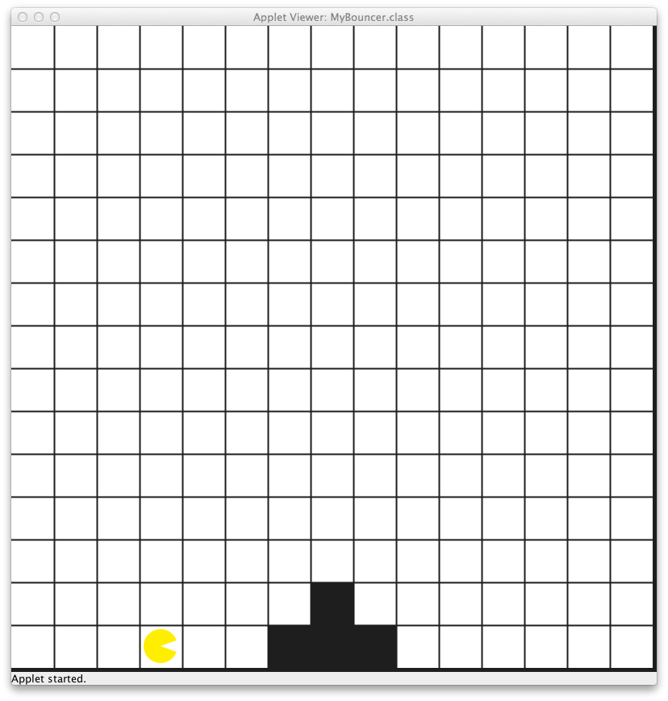

# U01 | Bouncer und das erste Hindernis

Lesen Sie die Aufgabenstellung gründlich durch und Vesuchen Sie, die beschriebenenen Probleme zuerst selbständig zu lösen. Grundlegende Informationen zum Umgang mit der Entwicklungsumgebung IntelliJ und zu den wichtigsten Bouncer-Befehlen finden Sie im GRIPS-Kurs. Bei Fragen stehen wir Ihnen per E-Mail oder im Discord zur Verfügung.                  
## Ausgangslage

Bouncers Welt ist 2-dimensional und wir betrachten sie von der Seite. Der untere Kartenrand stellt den Boden der Welt da, der obere ist die Decke. In der Welt gibt es keine Schwerkraft, d.h. Bouncer kann jedes freie Feld betreten und dazu auch an der *Wand hoch laufen*.  

| Bouncers Welt sieht so aus | 
|:------:| 
|  |  

Bouncer steht in einer leeren Welt, die außer ihm nur ein zwei Felder hohes Hindernis beeinhaltet. Bouncer soll bis zu diesem Hindernis laufen, über die gesperrten Felder hinüber klettern und auf der gegenüberliegenden Seite bis zur Wand laufen um dort stehenzubleiben. *Benutzen Sie die Karte **Obstacles** um die korrekte Welt zu laden (Siehe dazu im Handout zu Bouncer: `loadMap()` ).*  Dieses Beispiel ist einfach und Sie können auf die folgenden Annahmen bauen: Bouncer startet drei Felder vor dem Hindernis auf dessen linken Seite. Er schaut zu Beginn nach Osten, Die Welt sieht immer exakt so aus wie in der Abbildung dargestellt, d.h. das Hindernis ist gleich hoch und immer an der gleichen Position.  

## Aufgabe

Die Aufgabe besteht daraus, die Kommandos für Bouncer zu schreiben, um die folgenden Teilaufgaben zu lösen.  

1. Bis zum Hindernis laufen  
2. Am Hindernis auf der linken Seite hoch klettern  
3. Am Hindernis auf der rechten Seite herunter klettern  
4. Bis zur rechten Wand der Karte weitergehen  
  
**Hinweise:** Schreiben Sie eine eigene `private` -Methode für jeden der oben dargestellten Schritte. Ziel der Übung ist es mit dem grundsätzlichen Programmablauf vertraut zu werden und Übung darin zu bekommen, Probleme in kleinere Teilaufgaben zu zerlegen (*Decomposition*). Achten Sie darauf, sowohl den Code als auch die Kommentare (z. B. *pre*- und *post-conditions*) in Englisch zu schreiben. Verwenden Sie aussagekräftige Bezeichnungen für Ihre eigenen Methoden.
